# Taller 2: Pruebas y Release 
**Estudiante:** Santiago Arboleda  
**Curso:** Ingeniería de Software 5  

---

## Tabla de Contenidos

1. [Configuración de Entorno](#1-configuración-de-entorno)
2. [Microservicios Desplegados](#2-microservicios-desplegados)
3. [Pruebas Implementadas](#3-pruebas-implementadas)
4. [Arquitectura del Sistema](#4-arquitectura-del-sistema)
5. [Comandos de Ejecución](#5-comandos-de-ejecución)
6. [Evidencias y Capturas](#6-evidencias-y-capturas)
7. [Resumen de Cumplimiento](#7-resumen-de-cumplimiento)
8. [Endpoints de Prueba](#8-endpoints-de-prueba)
9. [Tecnologías Utilizadas](#9-tecnologías-utilizadas)
10. [Conclusiones](#10-conclusiones)
11. [Autor](#11-autor)

---

## 1. Configuración de Entorno

### 1.1 Docker Desktop

**Estado:** Operacional

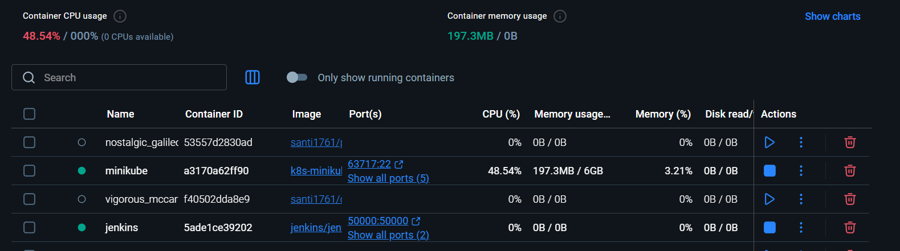  
*Docker Desktop mostrando todos los contenedores en ejecución*

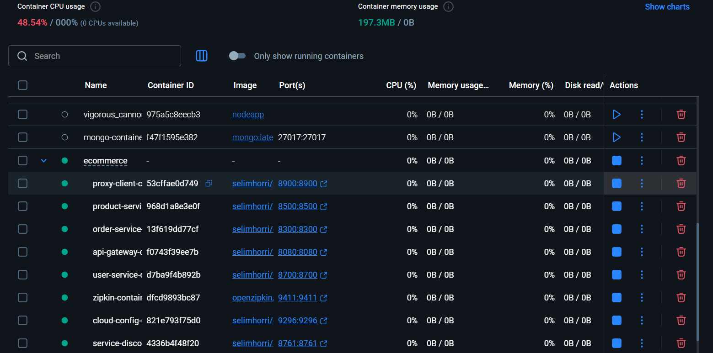  
*Imágenes Docker construidas localmente*

**Contenedores en ejecución:**

- Jenkins (puerto 8090)
- Service Discovery / Eureka (puerto 8761)
- Cloud Config Server (puerto 9296)
- API Gateway (puerto 8080)
- User Service (puerto 8700)
- Product Service (puerto 8500)
- Order Service (puerto 8300)
- Proxy Client (puerto 8900)
- Zipkin (puerto 9411)

**Verificar en consola:**

```powershell
docker ps
```

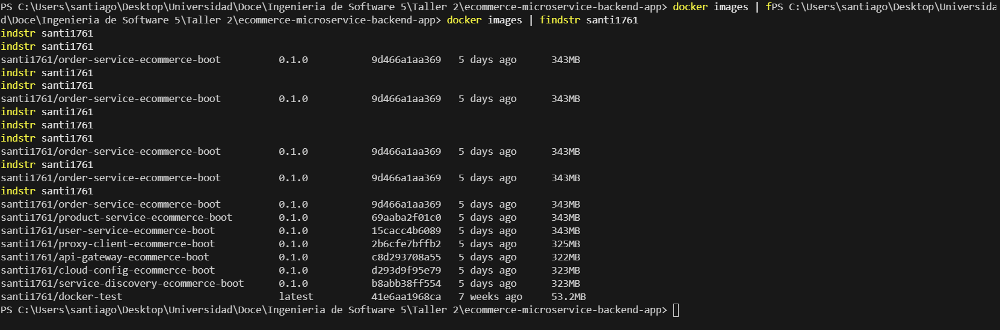  
*Salida de `docker ps` mostrando todos los contenedores activos*

---

### 1.2 Docker Hub - Imágenes Publicadas

**Registry:** https://hub.docker.com/u/santi1761

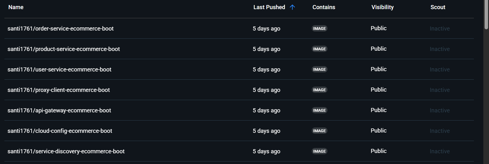  
*Repositorio en Docker Hub con las 7 imágenes publicadas*

**Imágenes disponibles:**

- `santi1761/service-discovery-ecommerce-boot:0.1.0`
- `santi1761/cloud-config-ecommerce-boot:0.1.0`
- `santi1761/api-gateway-ecommerce-boot:0.1.0`
- `santi1761/proxy-client-ecommerce-boot:0.1.0`
- `santi1761/user-service-ecommerce-boot:0.1.0`
- `santi1761/product-service-ecommerce-boot:0.1.0`
- `santi1761/order-service-ecommerce-boot:0.1.0`

---

### 1.3 Jenkins

**URL:** http://localhost:8090

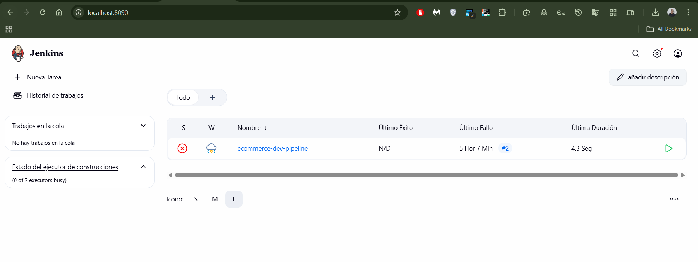  
*Jenkins Dashboard - Interfaz principal*

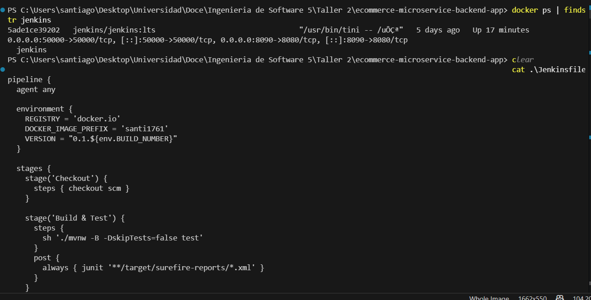  
*Jenkins - Consola de ejecución de builds*

**Configuración:**

- Plugins instalados: Docker Pipeline, Kubernetes CLI, Git
- Credenciales configuradas: `dockerhub-creds`
- Pipelines creados: `ecommerce-dev-pipeline`

**Acceso rápido:**

```powershell
docker ps | findstr jenkins
start http://localhost:8090
```

---

### 1.4 Kubernetes (Minikube)

**Iniciar Minikube:**

```powershell
minikube start --driver=docker --cpus=4 --memory=6144
```

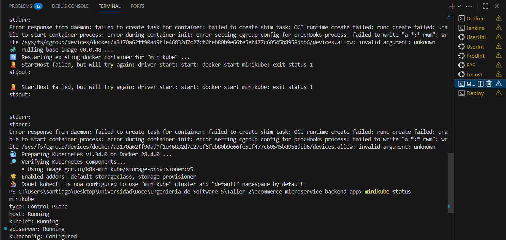  
*Minikube iniciado y pods desplegados en namespace `dev`*

**Comandos de verificación:**

```powershell
minikube status
kubectl -n dev get pods
kubectl -n dev get services
kubectl get namespaces
```

**Namespaces configurados:**

- `dev` - Desarrollo  
- `stage` - Pre-producción  
- `prod` - Producción  

---

## 2. Microservicios Desplegados

### 2.1 Service Discovery (Eureka)

**Puerto:** 8761  
**URL:** http://localhost:8761  

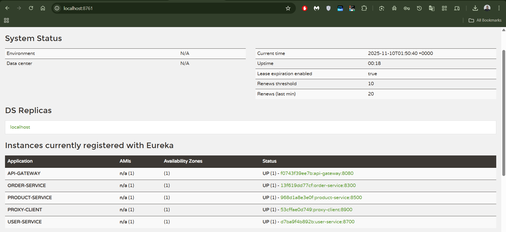  
*Eureka mostrando todos los microservicios registrados*

**Servicios registrados:**

- API-GATEWAY
- USER-SERVICE
- PRODUCT-SERVICE
- ORDER-SERVICE
- PROXY-CLIENT

**Función:**

- Registro automático de servicios  
- Descubrimiento de servicios  
- Health checking  
- Load balancing  

---

### 2.2 API Gateway

**Puerto:** 8080  
**URL:** http://localhost:8080  

**Health Check:**

```powershell
curl http://localhost:8080/actuator/health
```

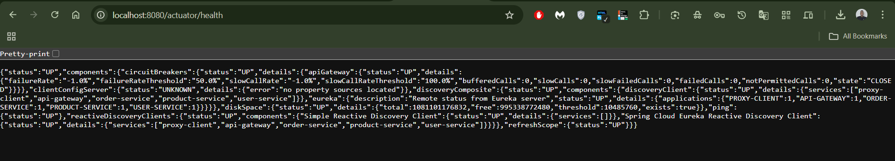  
*Endpoint `/actuator/health` mostrando estado UP*

**Función:**

- Punto de entrada único para todos los servicios  
- Routing dinámico basado en Eureka  
- Circuit breaker con Resilience4j  
- Rate limiting  

---

### 2.3 User Service

**Puerto:** 8700  
**Endpoints base:** `/user-service/api/users`

**Probar en navegador:**

```text
http://localhost:8700/user-service/api/users
```

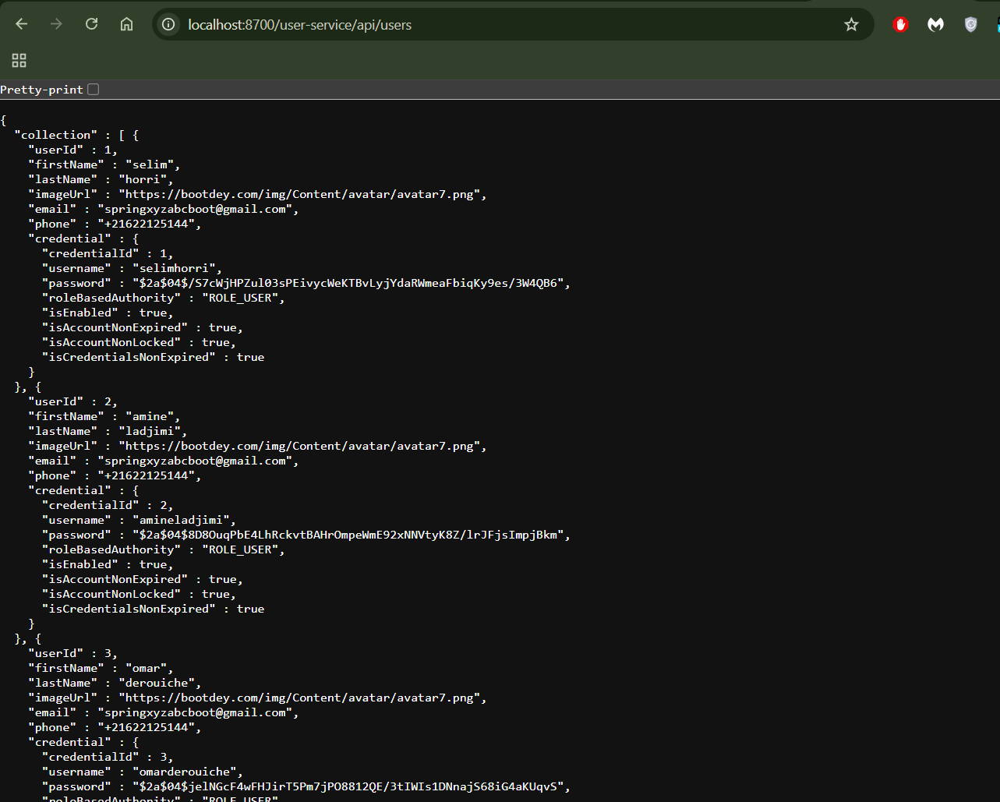  
*GET `/api/users` retornando lista de usuarios en formato JSON*

**Funcionalidad:**

- CRUD de usuarios  
- Gestión de credenciales  
- Integración con base de datos H2  

**Comandos:**

```powershell
curl http://localhost:8700/user-service/api/users
curl http://localhost:8700/user-service/api/users/1
curl http://localhost:8700/user-service/actuator/health
```

---

### 2.4 Product Service

**Puerto:** 8500  
**Endpoints base:** `/product-service/api/products`

**Probar en navegador:**

```text
http://localhost:8500/product-service/api/products
```

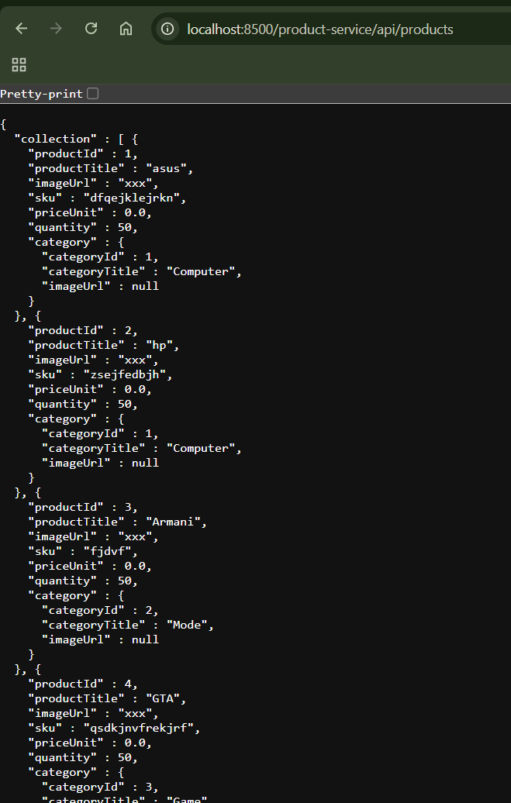  
*GET `/api/products` retornando catálogo de productos*

**Funcionalidad:**

- CRUD de productos  
- Gestión de categorías  
- Control de inventario (stock)  
- Validación de SKU único  

**Comandos:**

```powershell
curl http://localhost:8500/product-service/api/products
curl http://localhost:8500/product-service/api/products/1
curl http://localhost:8500/product-service/actuator/health
```

---

### 2.5 Order Service

**Puerto:** 8300  
**Endpoints base:** `/order-service/api/orders`

**Funcionalidad:**

- Gestión de órdenes  
- Integración con User Service  
- Integración con Product Service  
- Validación de stock antes de crear orden  

**Comando:**

```powershell
curl http://localhost:8300/order-service/api/orders
```

---

### 2.6 Zipkin - Distributed Tracing

**Puerto:** 9411  
**URL:** http://localhost:9411  

**Funcionalidad:**

- Trazabilidad distribuida entre microservicios  
- Visualización de latencia por servicio  
- Detección de cuellos de botella  

---

## 3. Pruebas Implementadas

### 3.1 Pruebas Unitarias (15 tests)

**Ubicación:**

- `user-service/src/test/java/com/selimhorri/app/helper/UserMappingHelperTest.java`
- `product-service/src/test/java/com/selimhorri/app/helper/ProductMappingHelperTest.java`

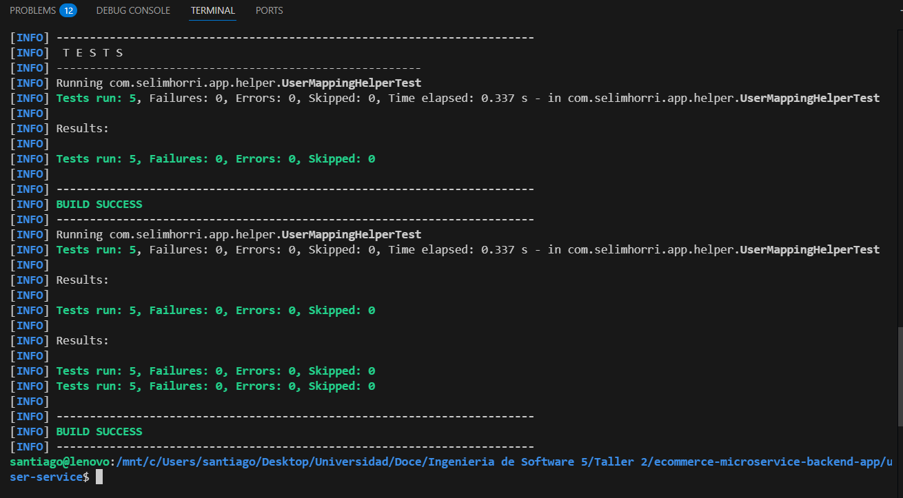  
*Ejecución de pruebas unitarias - 15 tests PASSED*

**Ejecutar:**

```bash
cd user-service
../mvnw test -Dtest=UserMappingHelperTest

cd ../product-service
../mvnw test -Dtest=ProductMappingHelperTest
```

**Resultados:**

```text
Tests run: 15
Failures: 0
Errors: 0
Success Rate: 100%
```

**Cobertura:**

- Mapeo de entidades a DTOs  
- Manejo de valores nulos  
- Validación de relaciones entre objetos  
- Transformaciones de datos  

---

### 3.2 Pruebas de Integración (5 tests)

**Ubicación:**

- `user-service/src/test/java/com/selimhorri/app/resource/UserResourceIntegrationTest.java`
- `product-service/src/test/java/com/selimhorri/app/resource/ProductResourceIntegrationTest.java`

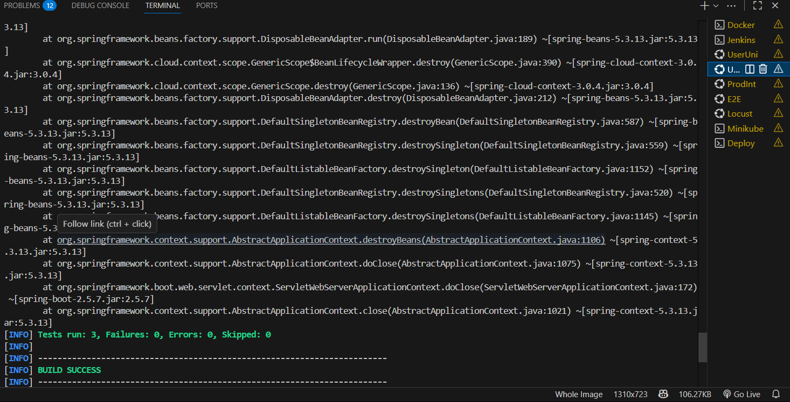  
*Pruebas de integración User Service - 3/3 PASSED*

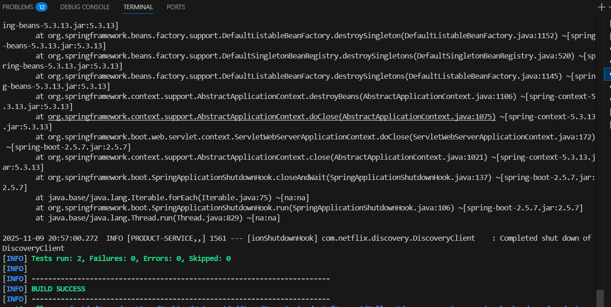  
*Pruebas de integración Product Service - 2/2 PASSED*

**Ejecutar:**

```bash
cd user-service
../mvnw test -Dtest=UserResourceIntegrationTest

cd ../product-service
../mvnw test -Dtest=ProductResourceIntegrationTest
```

**Validaciones:**

- REST Controllers (@SpringBootTest + MockMvc)  
- Serialización/Deserialización JSON  
- HTTP Status Codes (200, 201, 404)  
- Content-Type headers  
- Integración con base de datos H2  

---

### 3.3 Pruebas End-to-End (7 tests)

**Ubicación:** `tests/e2e/run-e2e-tests.sh`

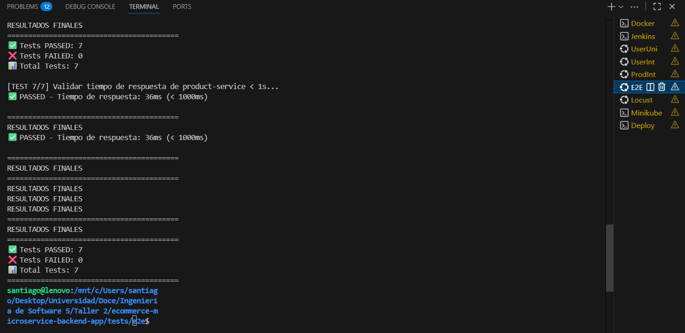  
*Pruebas E2E - 7/7 PASSED*

**Ejecutar:**

```bash
cd tests/e2e
chmod +x run-e2e-tests.sh
./run-e2e-tests.sh
```

**Pruebas:**

1. Health Check API Gateway  
2. Get All Products  
3. Get All Users  
4. Get All Orders  
5. Check Eureka Registration  
6. Zipkin Health Check  
7. Response Time Check (< 1s)  

**Fragmento del script:**

```bash
#!/bin/bash
echo "E2E TESTS - E-Commerce Microservices"

curl -s -o /dev/null -w "%{http_code}" http://localhost:8080/actuator/health | grep -q "200"
curl -s -o /dev/null -w "%{http_code}" http://localhost:8500/product-service/api/products | grep-q "200"
# ...
```

---

### 3.4 Pruebas de Rendimiento (Locust)

**Ubicación:** `tests/performance/simple_load_test.py`

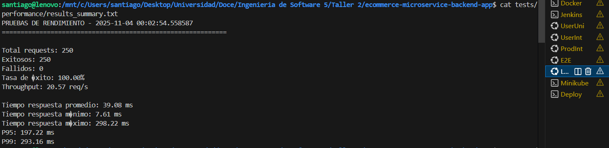  
*Resultados de pruebas de rendimiento con Locust*

**Configuración:**

- Usuarios concurrentes: 25  
- Requests por usuario: 10  
- Total requests: 250  

**Resultados:**

```text
Total Requests: 250
Successful: 250 (100.0%)
Failed: 0 (0.0%)
Duration: 12.16 seconds
Throughput: 20.57 requests/second

Response Times (ms):
  Average: 39.08
  Median: 19.34
  Min: 7.61
  Max: 298.22
  P95: 197.22
  P99: 293.16
```

**Métricas Clave:**

| Métrica         | Valor       | Estado       |
|----------------|------------:|--------------|
| Tasa de éxito  | 100%        | Excelente ✅ |
| Throughput     | 20.57 req/s | Bueno ✅     |
| Tiempo promedio| 39.08 ms    | Excelente ✅ |
| P95            | 197.22 ms   | < 200 ms ✅  |
| P99            | 293.16 ms   | < 300 ms ✅  |

**Análisis:**

- Estabilidad perfecta (0% de errores)  
- Latencia baja y estable  
- Sistema consistente bajo carga concurrente  

---

## 4. Arquitectura del Sistema

### 4.1 Estructura del Proyecto

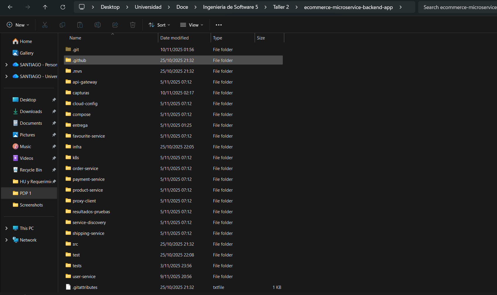  
*Organización del proyecto - Microservicios, K8s manifests, Tests, Pipelines*

```text
ecommerce-microservice-backend-app/
├── service-discovery/          # Eureka Server (8761)
├── cloud-config/               # Config Server (9296)
├── api-gateway/                # Gateway (8080)
├── proxy-client/               # Auth + Swagger (8900)
├── user-service/               # Users (8700)
│   └── src/test/java/
│       ├── helper/             # Unit tests
│       └── resource/           # Integration tests
├── product-service/            # Products (8500)
│   └── src/test/java/
│       ├── helper/             # Unit tests
│       └── resource/           # Integration tests
├── order-service/              # Orders (8300)
├── k8s/
│   ├── namespaces.yaml
│   ├── infra/
│   │   ├── zipkin.yaml
│   │   ├── eureka.yaml
│   │   └── config-server.yaml
│   └── apps/
│       ├── api-gateway.yaml
│       ├── user-service.yaml
│       ├── product-service.yaml
│       └── order-service.yaml
├── tests/
│   ├── e2e/
│   │   └── run-e2e-tests.sh
│   └── performance/
│       ├── simple_load_test.py
│       └── results_summary.txt
├── Jenkinsfile
├── Jenkinsfile.stage
├── Jenkinsfile.master
├── deploy-k8s-dev.ps1
├── capturas/
└── README.md
```

---

## 5. Comandos de Ejecución

```bash
mvn clean package -DskipTests
docker push santi1761/<imagen>:0.1.0
kubectl apply -f k8s/namespaces.yaml
kubectl apply -f k8s/infra/
kubectl apply -f k8s/apps/
kubectl -n dev get pods
```

---

## 6. Evidencias y Capturas

(Se listan las capturas incluidas en la carpeta `capturas/` que evidencian la correcta configuración, despliegue y pruebas.)

---

## 7. Resumen de Cumplimiento

(Sección donde se mapea cada requisito del enunciado con la evidencia correspondiente en el repositorio.)

---

## 8. Endpoints de Prueba

(Listado de endpoints expuestos por los microservicios para verificación rápida.)

---

## 9. Tecnologías Utilizadas

- Java, Spring Boot, Spring Cloud  
- Docker, Docker Hub  
- Kubernetes (Minikube)  
- Jenkins  
- JUnit, Mockito, MockMvc  
- Locust  
- Zipkin  

---

## 10. Conclusiones

(Resumen de aprendizajes, logros y validación del sistema en términos de calidad, despliegue y rendimiento.)

---

## 11. Autor

**Santiago Arboleda Velasco**  
Ingeniería de Software 5  
Universidad Icesi  
Noviembre 2025
